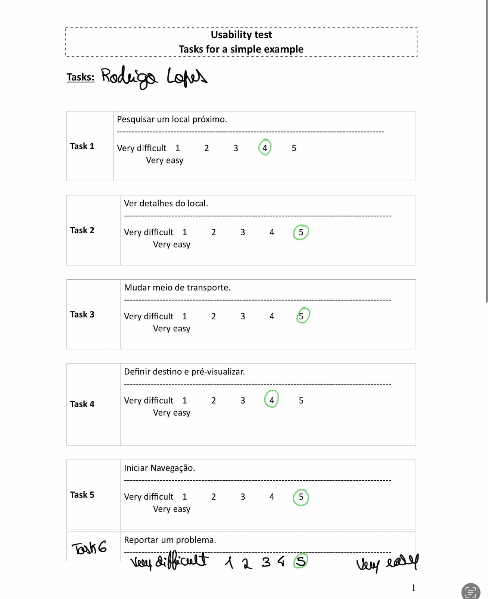
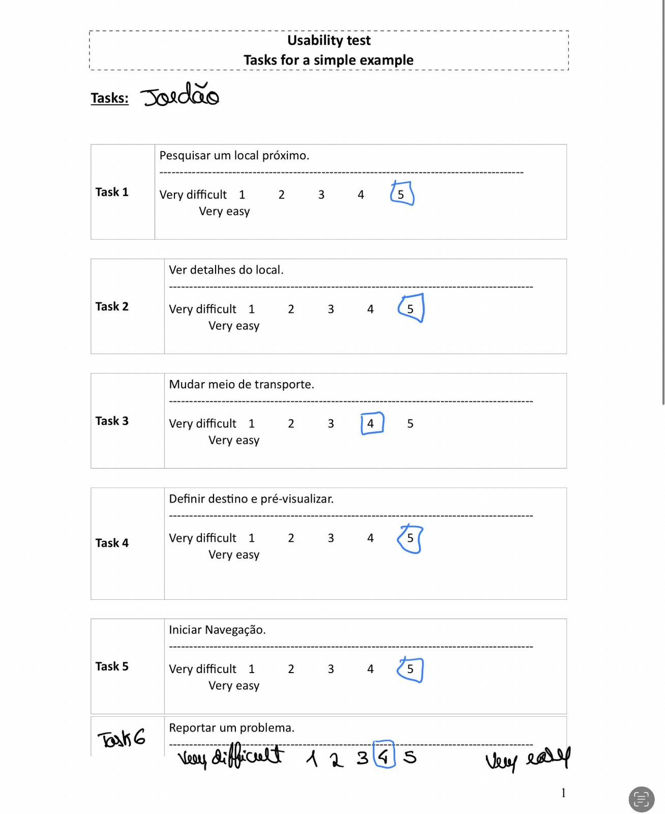
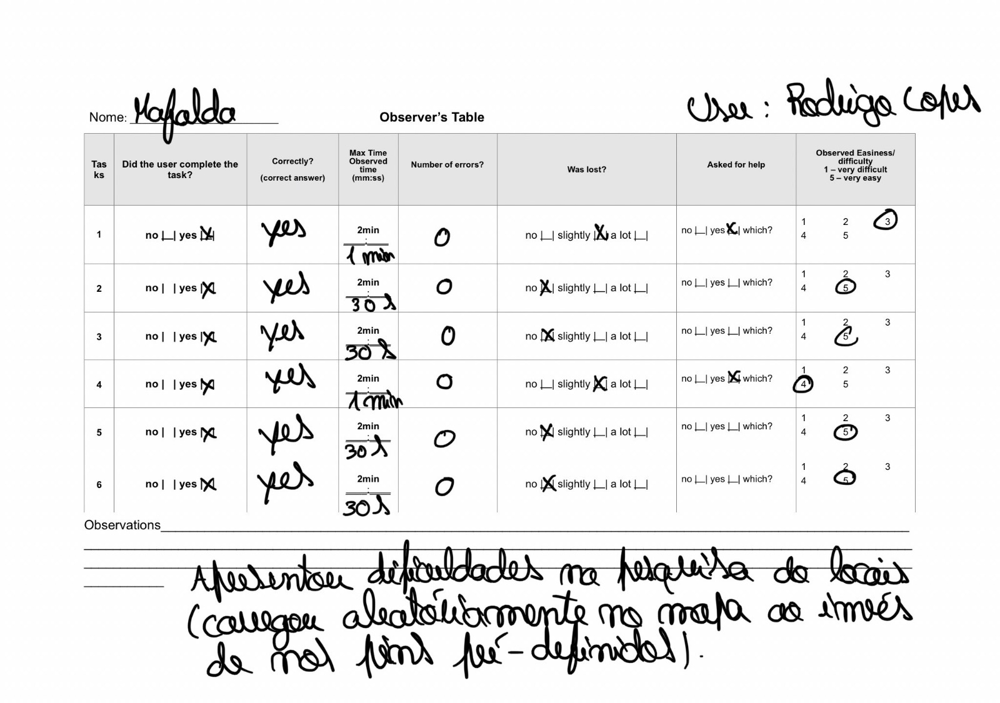
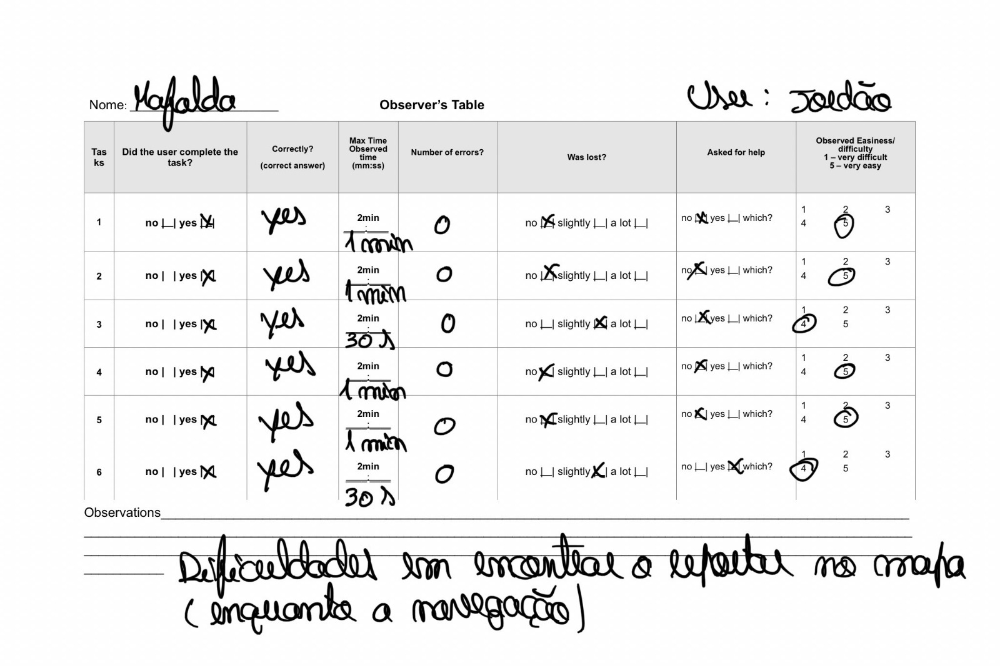

[Back to main Logbook Page](../hci_logbook.md)

---

# E. Functional Prototype and Evaluation

# Prototype

INSERIR IMAGEM

No desenvolvimento da aplicação foi usado:
- Ferramentas: VS Code (development)
- Linguagens: HTML, CSS, JavaScript
- Livrarias: React.jsx, Leaflet, Vite

# E.X. User Evaluation

Foram entregues aos testers 2 formulários diferentes:
O primeiro com tasks para realizarem e depois definirem o quão fácil foi para eles fazer isso e o segundo seguindo a System Usability Scale (SUS) para averiguar num plano geral a opinião dos users sobre a app.
Os testes foram feitos com 11 pessoas mas temos aqui apenas dois exemplos de folhas completas como exemplo, visto que os resultados foram muito semelhantes a estes:
#  
#  

As respostas aos segundos formulários para as mesmas pessoas apresentadas acima são estes:

- I think that I would like to use this system frequently.  
User1:  5  User2:  5
- I found the system unnecessarily complex.  
User1:  1  User2:  1
- I thought the system was easy to use.  
User1:  5  User2:  4
- I think that I would need the support of a technical person to be able to use this system.  
User1:  1  User2:  1
- I found the various functions in this system were well integrated.  
User1:  4  User2:  4
- I thought there was too much inconsistency in this system.  
User1:  1  User2:  2
- I would imagine that most people would learn to use this system very quickly.  
User1:  5  User2:  5
- I found the system very cumbersome to use.  
User1:  1  User2:  3
- I felt very confident using the system.  
User1:  5  User2:  4
- I needed to learn a lot of things before I could get going with this system.  
User1:  1  User2:  2

Além disso, utilizamos uma tabela de observador para anotar as ações dos nossos users apontando lá opiniões que eles nos deram durante a utilização também:

#  
#  

---
[Back to main Logbook Page](../hci_logbook.md)

---