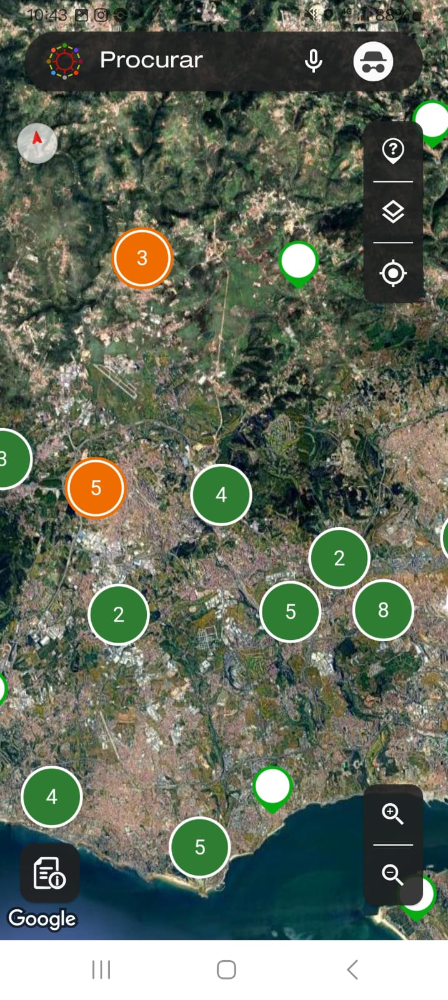

# Competitor Analysis: [Acessibilidade 360 App] 
## General Information 
- **Name of System:** [Acessibilidade 360 App] 
- **Company/Developer:** [INR] 
- **Website/Product Page:** [https://www.inr.pt/app-acessibilidade-360] 
- **Version/Release Date:** [31/12/2024] 
- **Platform(s) Supported:** [Mobile (Android)] 
- **Target Audience:** Pessoas de mobilidade reduzida e outra que queiram ajudar a sinalizar caminhos

--- 
## Core Functionality 

**Primary Purpose:** A APP Acessibilidade 360 foi criada para facilitar o acesso aos serviços públicos, tendo em conta as necessidades específicas de mobilidade de cada pessoa.

**Key Features:** - Mapeamento de acessibilidade - Avaliação de locais 

**Unique Selling Points (USPs):** - Feedback em tempo real - Foco na acessibilidade urbana

**Limitations/Weaknesses:** - Cobertura limitada de dados - Opções limitadas de tipos de percurso

---

## Screenshots
#  

## Online Reviews
